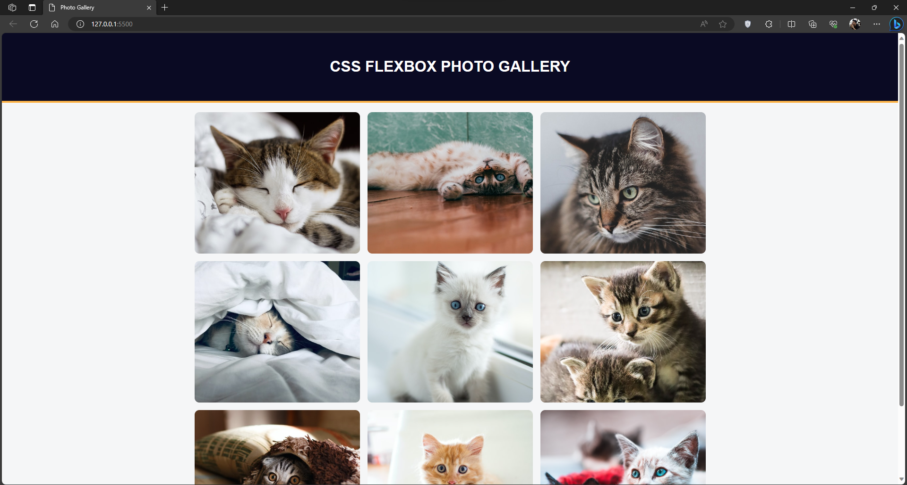
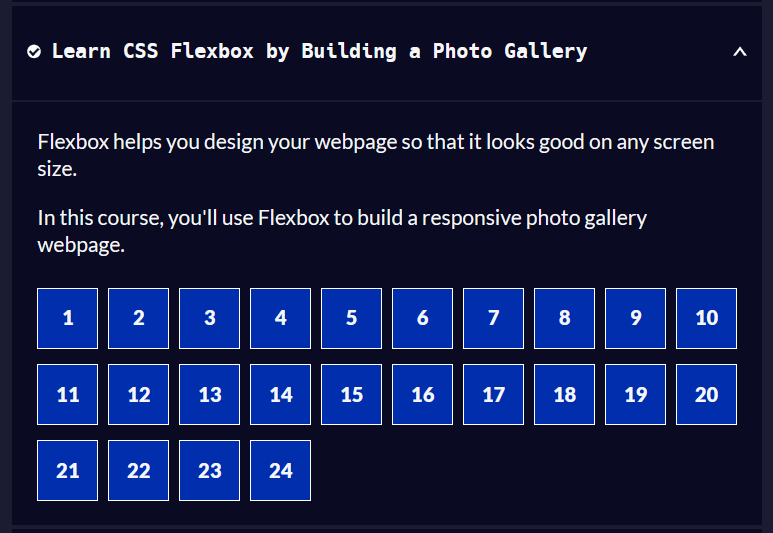

# Photo Gallery
The purpose of this repo is to monitor my progress in learning CSS by making a basic Photo Gallery. I am utilizing the freeCodeCamp [Learn CSS Flexbox by Building a Photo Gallery](https://www.freecodecamp.org/learn/2022/responsive-web-design/#learn-css-flexbox-by-building-a-photo-gallery) for this repo.

## Screenshots

## Learnings
1. Using "*" to apply the effect in all elements in the page in CSS.
2. Using different syntax like display: flex to make the page responsive.
3. Using the "justify-content" property to align the items in the page.
4. To avoid the image from being distorted, we can use object-fit: cover.
5. Lastly, the border-radius which is very popular in CSS.
